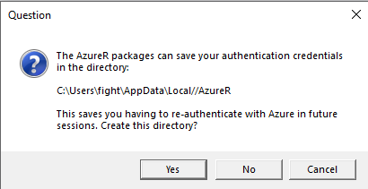

# R OneDrive Updating Script
R script to update personal OneDrive(s) based on inputted folders.

## Instructions

### Azure Login Prompt

When using the script, a popup similar to the image below will occur. I recommend selecting "no" as this will allow you to change between multiple OneDrives on different Microsoft accounts.

